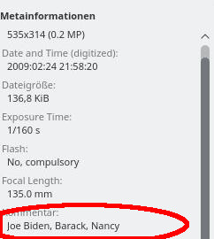

# FaceTag

Organizes pictures according to peoples faces in the pictures. It also writes the peoples names in the usercomment EXIF tag. It uses the amazing [face_recognition](https://github.com/ageitgey/face_recognition) based on dlib. 
This brings super easy face recognition to you without uploading any to facebook, google, etc. No internet connection required! Everything stays on your computer.


After some time initial labeling faces, I organized my entire picture collection of 20k pictures over night. The unrecognized faces are softliked in the folder "unkown" (this also serves as a pool to improve face recognition for a future run).


## Usage

It can be used in the console using
```
python facetag.py
```
or in a jupyter notebook.


### Give a picture directory
```
python facetag.py  --folder demo
```
and it will recursively get all jpg files.


and also rotate them according to the Orientation exif tag using [jhead](http://www.sentex.net/~mwandel/jhead/).

### Label first faces 
It asks for the names of all unknown people in a picture and adds them to it's name database.


### Exif Comment Tag
The exif user_comment tag is filled with the names from the left to the right :-) 



### Face recognition and labeling already working automatically
Already in the next picture it can recognize Barack and no user action is needed.


and in the next picture too:


### Folders with Softlinks  
Additionally to EXIF tags, subfolders with softlinks are created according to the names.


## Installation and dependencies

Getting dlib to work is a little tricky. The following works for me (with an anaconda environment):
```
sudo apt install jhead python3-pip
conda install -c menpo dlib 
pip3 install face_recognition
```
