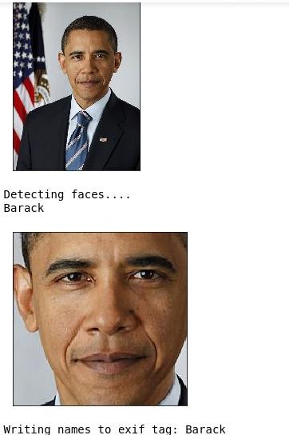

# FaceTag

Organizes pictures according to peoples faces in the pictures. It also writes the peoples names in the usercomment EXIF tag. It uses the amazing [face_recognition](https://github.com/ageitgey/face_recognition) based on dlib. 

## Usage

It can be used in the console using
`python face-rec.py`
or in a jupyter notebook.

### Label first faces 

### Face recognition and labeling already working automatically:

### Folders with Softlinks  

## Installation

The dependencies require some trial and error. The following works for me (with an anaconda environment):
`conda install -c menpo dlib 
pip install face_recognition`
